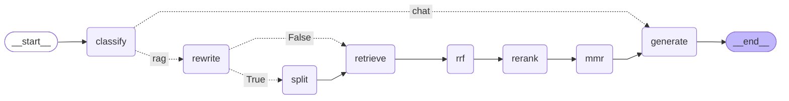

# LangGraph RAG 优化流水线

基于 **LangGraph** 的可编排 RAG 流水线，集成查询优化、混合检索、重排序与多样性筛选。

## 流程

```
用户问题 → 问题重写 → [可选拆分] → 混合检索(稠密+稀疏) → RRF融合 → Cross-encoder重排 → MMR筛选 → 生成答案
```

## 技术栈

| 组件 | 选型 |
|------|------|
| 图编排 | LangGraph, LangChain |
| LLM | DeepSeek (`deepseek-chat`) |
| Embedding | 阿里云百炼 `text-embedding-v3` |
| 稠密检索 | Chroma |
| 稀疏检索 | BM25 (`rank_bm25`) |
| 交叉编码器 | `cross-encoder/ms-marco-MiniLM-L-6-v2` |
| 依赖管理 | uv |

## 快速开始

```bash
# 1. 配置环境变量
cp .env.example .env
# 编辑 .env，填入 DEEPSEEK_API_KEY 和 DASHSCOPE_API_KEY

# 2. 上传文档构建索引
uv run python scripts/upload_docs.py --dir data/documents

# 3. 运行 RAG
uv run python src/main.py --question "什么是RAG技术？"

# 4. 启用 Multi-Hop
uv run python src/main.py --question "LangGraph和RAG的关系？" --multi-hop
```

## 项目结构

```
├── langgraph.json            # LangGraph API 服务配置
├── config/settings.py       # 配置管理
├── src/
│   ├── state.py             # RAGState
│   ├── main.py              # CLI 入口
│   ├── graph/
│   │   ├── builder.py       # LangGraph 图构建
│   │   └── agent.py         # 编译后的图实例（供 langgraph dev 使用）
│   ├── nodes/               # 7 个处理节点
│   ├── retrieval/           # 稠密/稀疏/混合检索
│   ├── rerankers/           # Cross-encoder 重排
│   └── utils/               # 工具函数
├── scripts/upload_docs.py   # 文档上传与索引构建
├── src/api/                 # FastAPI 聊天后端
│   ├── server.py            # FastAPI 应用入口
│   ├── routes.py            # API 路由（chat/session/upload）
│   ├── sessions.py          # 会话管理
│   └── static/              # 前端页面
├── langgraph.json            # LangGraph API 服务配置
├── start_chat_server.cmd    # 一键启动 FastAPI 聊天服务
├── start_dev_server.cmd     # 一键启动 LangGraph API 开发服务器
└── data/documents/          # 原始文档
```

## LangGraph流程图



## 索引构建

```bash
# 上传文档（自动分块后同时构建 Chroma + BM25 索引）
uv run python scripts/upload_docs.py --dir data/documents --chunk-size 512 --chunk-overlap 64

# 重置后重建
uv run python scripts/upload_docs.py --dir data/documents --reset
```

## 可调配置

```env
# .env
DEEPSEEK_API_KEY=sk-xxx
DASHSCOPE_API_KEY=sk-xxx
CHUNK_SIZE=512
TOP_K_HYBRID=20       # 混合检索召回数
TOP_K_RERANK=10       # 重排后保留数
TOP_K_MMR=5           # MMR 最终文档数
USE_MULTI_HOP=false   # 默认不启用问题拆分
```

## Web 聊天界面（FastAPI）

内置的 FastAPI 应用提供完整的聊天 Web 界面，支持多会话、文档上传和 Multi-Hop 配置。

```bash
# 一键启动
start_chat_server.cmd

# 或手动启动：
PYTHONUTF8=1 .venv\Scripts\uvicorn src.api.server:app --host 127.0.0.1 --port 8000 --reload
```

打开浏览器访问 `http://127.0.0.1:8000`。

**API 端点：**
| 方法 | 路径 | 说明 |
|------|------|------|
| GET | `/` | 聊天界面首页 |
| POST | `/api/chat` | 发送消息 `{ question, session_id?, use_multi_hop? }` |
| POST | `/api/session/create` | 创建新会话 |
| GET | `/api/session/{id}/history` | 获取历史消息 |
| POST | `/api/upload` | 上传文档（multipart/form-data） |

## LangGraph 可视化管理界面

本项目还支持通过 **LangSmith Studio** 和 **Agent Chat UI** 两种图形界面进行交互。

### LangSmith Studio（推荐）

```bash
# 启动开发服务器
start_dev_server.cmd
# 或手动运行：
PYTHONUTF8=1 .venv\Scripts\langgraph dev --port 2024
```

启动后访问：
- **Studio UI**：[`https://smith.langchain.com/studio/?baseUrl=http://127.0.0.1:2024`](https://smith.langchain.com/studio/?baseUrl=http://127.0.0.1:2024)
- **API 文档**：[`http://127.0.0.1:2024/docs`](http://127.0.0.1:2024/docs)
- **API 端点**：`http://127.0.0.1:2024`

Studio 支持可视化图结构、单步调试、热重载等功能。

### Agent Chat UI（聊天界面）

```bash
start_chat_ui.cmd
# 或手动运行：
cd chat-ui
pnpm dev
```

启动后打开 `http://localhost:3000`，配置 `API URL` 为 `http://localhost:2024`，`Graph ID` 为 `rag_agent` 即可开始对话。

### 配置文件

项目根目录 `langgraph.json` 定义了图服务配置：

```json
{
  "dependencies": ["."],
  "graphs": {
    "rag_agent": "./src/graph/agent.py:graph"
  },
  "env": ".env"
}
```

## 追踪

集成 LangSmith，在 `.env` 设置 `LANGSMITH_TRACING=true` 即可在 [smith.langchain.com](https://smith.langchain.com) 查看追踪。
